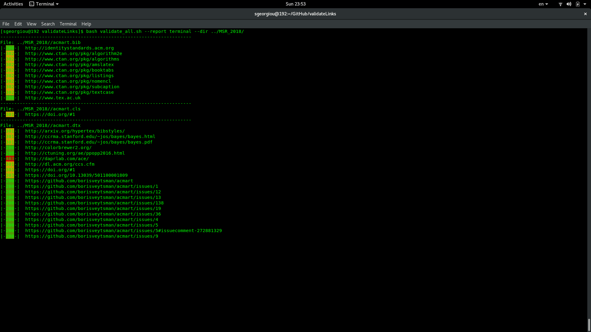

# About validateLinks

A repository with purpose on reporting if the existing links in a user's repository, local directory, or a givne link are valid.

Our mission here is to provide a tool that can check if the links found, not only in html documents but any kind of, in different documents are not broken. 
Also, we extend the features of our tool to perform First Depth Search (FDS) to identify even more links found under tree directories.
The tool can report its results in a terminal or in a form of email reports giving the descriptive analysis and an overall report. 

# Dependencies

* Install lynx command for --link option

# Try it out

There are curretly two venues for using our tool:

* Added here the repository's link, your mail address, and we will analyze it for you. 
* Download our tool and use it as a commnad line arguments

When adding your repo for online analysis, we are creating a clone of it and by using travis we are analyzing and reporting.
An additional feature of the first approach is the crontab interval a user can set to perform analysis in specific intervals.

	$ bash validateLinks --report <terminal, email> --dir ../${ROOT_DIR}/

	or

	$ bash validateLinks --report <terminal, email> --repository https://github.com/stefanos1316/validateLinks.git

	or

	$ bash validateLinks --report <terminal, email> --link https://stefanos1316.github.io/my_curriculum_vitae/index.html

# Overview

<table class="image">
<tr><td> </td></tr>
<tr><td class="caption" align="center">Analyzing Repository</td></tr>
</table>

# Contributions and used Repositories

* [Bash-spinner](https://github.com/tlatsas/bash-spinner)
* Special thanks to my friend [Alexandre De Masi](https://github.com/SheepOnMeth) for the testing.
